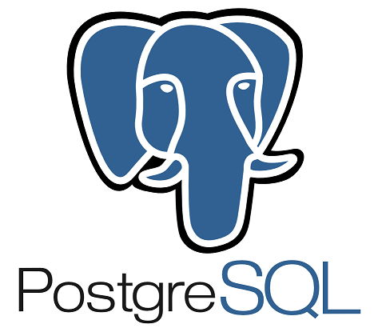

# Pagarme - Go Software Engineer Challenge 

<p align="center">
	
	
</p>

<p align="center">
  
</p>

### [Original challenge readme](https://website-name.com)


## Run locally

### Required

- [Docker](https://docs.docker.com/install/)
- [Docker Compose](https://docs.docker.com/compose/install/)
- [Golang 1.21.3](https://golang.org/doc/install)
  
### Install

```bash
git clone git@github.com:ggarber42/payme.git
cd payme
go mod download
```

### Build

Rename the .env.example to .env file

Run the docker compose command

```bash
docker compose up -d --build
```

### Check

Check if it's running

```bash
curl -i localhost:3000/healthcheck
```

### Test manually

The payload must be like the following:

```json
{
    "cardData": {
        "name": "John Doe",
        "token": "7zIzcfXQJId44/NCv1o8hQ==",
        "expireDate": "12/32",
			  "flag": "mishacard"
    },
    "purchase": {
        "purchaseId": "12345",
        "date": "2024-11-04T12:30:00Z",
        "customerId": "cust_67890",
        "totalAmount": 1500.0,
        "currency": "USD",
        "products": [
            {
                "id": "12345",
                "name": "Product 1",
                "quantity": 1,
                "price": 100.00
            },
            {
                "id": "67890",
                "name": "Product 2",
                "quantity": 2,
                "price": 150.00
            }
        ],
        "installments": {
            "numberOfInstallments": 2,
            "installmentAmount": 125.00,
            "totalInstallmentAmount": 250.00
        }
    },
    "store": {
        "name": "Raimunda e Sebastião Construções ME",
        "cnpj": "32.442.717/0001-80",
        "address": {
            "street": "Rua R-Trinta e Nove",
            "number": "376",
            "cep": "13279-105"
        }
    },
    "vendor": "cielo"
}
```

Payment requests can be done in the following:

```bash
http://localhost:3000/payment/stone
http://localhost:3000/payment/rede
http://localhost:3000/payment/cielo
```

Request example:

```bash
curl --request POST \
  --url http://localhost:3000/payment/stone \
  --header 'Content-Type: application/json' \
  --data ' {
    "cardData": {
        "name": "John Doe",
        "token": "7zIzcfXQJId44/NCv1o8hQ==",
        "expireDate": "12/32",
			  "flag": "mishacard"
    },
    "purchase": {
        "purchaseId": "12345",
        "date": "2024-11-04T12:30:00Z",
        "customerId": "cust_67890",
        "totalAmount": 1500.0,
        "currency": "USD",
        "products": [
            {
                "id": "12345",
                "name": "Product 1",
                "quantity": 1,
                "price": 100.00
            },
            {
                "id": "67890",
                "name": "Product 2",
                "quantity": 2,
                "price": 150.00
            }
        ],
        "installments": {
            "numberOfInstallments": 2,
            "installmentAmount": 125.00,
            "totalInstallmentAmount": 250.00
        }
    },
    "store": {
        "name": "Raimunda e Sebastião Construções ME",
        "cnpj": "32.442.717/0001-80",
        "address": {
            "street": "Rua R-Trinta e Nove",
            "number": "376",
            "cep": "13279-105"
        }
    },
    "vendor": "cielo"
}'
```

### Run tests

```bash
make unit-test
```

### Terminate

```bash
docker compose down
```
